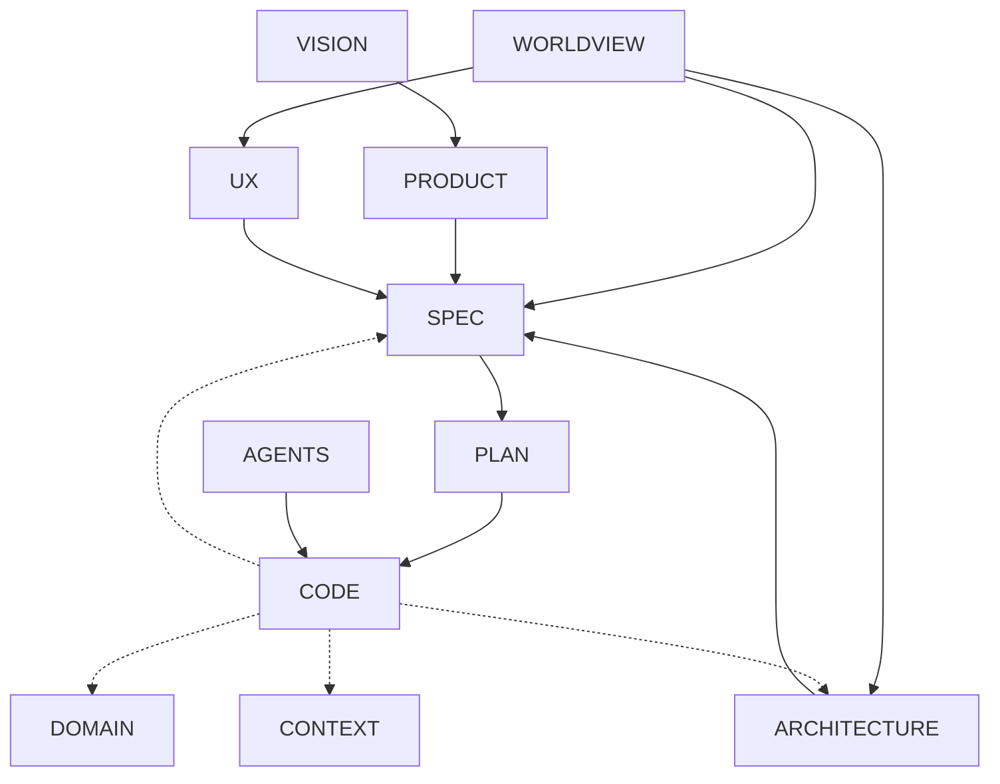

# Context-Driven Engineering (CDE)

## Overview

**Context-Driven Engineering (CDE)** is a disciplined, AI-aware approach to software engineering that treats *context* (vision, specification, architecture, planning, and rules of engagement) as the primary engineering artifact.

In CDE, code is not the source of truth. It is a *projection* of context, produced by humans or AI agents acting within clearly defined constraints.

CDE is not about optimizing context for language models, but about structuring software engineering so that context remains authoritative over time.

CDE is intentionally demanding. It is designed for software craftsmen and teams who care about conceptual integrity, long-term maintainability, and explicit reasoning, rather than maximum speed through improvisation.

This document defines the discipline and its rules. A separate “CDE Explained” document provides the system-level mental model and rationale behind these rules.

---

## Core Claim

> If the context is vague, the software is already broken, even if the code runs.

CDE does **not** claim that good context guarantees perfect software. It claims that poor context guarantees fragile software.

---

**What “Driven” Means in Context-Driven Engineering**

In Context-Driven Engineering, context does not merely exist as background information.  
It **actively drives** decisions throughout the system.

Context in CDE:

- drives design decisions rather than documenting them after the fact
- constrains interpretation so that behavior is not inferred inconsistently
- governs change by making upstream intent explicit before downstream implementation
    

When context changes, downstream artifacts are expected to follow.  
When downstream reality conflicts with context, the context must be revised explicitly.

This directional relationship is intentional and non-negotiable.

---

## Rationality vs Reality (How and Why We “Fake It”)

CDE does **not** assume that software is designed in a perfectly rational, linear process.

In practice:

* Understanding emerges through exploration
* Designs evolve as constraints surface
* Decisions are often revised with hindsight

CDE adopts the stance that while design is rarely discovered rationally, it is **maintained as if it were**, because doing so:

* Makes systems reviewable
* Makes reasoning explicit
* Makes maintenance and handover possible

Documentation in CDE therefore represents the **best current explanation** of the system, not a historical transcript of how it was discovered.

---

## Exploration and Commitment

CDE explicitly allows for exploration, experimentation, and partial understanding.

Rather than enforcing rigid phases, CDE distinguishes between *ongoing exploration* and *commitment points*.

### Exploration

Most day-to-day work happens here.

Characteristics:

* Code and notes may be incomplete
* Context documents may lag behind discoveries
* Experiments, spikes, and discarded ideas are normal

Expectation:

* Leave breadcrumbs: what was tried, what was learned, what failed

Exploration is not a failure mode. It is how understanding is gained.

### Commitment Points

CDE is enforced at commitment points, such as:

* Preparing a release
* Reaching a milestone
* Handing work to another developer or team
* Asking an AI agent to extend or refactor existing behavior

At these points:

* Context must be coherent and internally consistent
* Specifications become authoritative
* Known contradictions are resolved or explicitly documented

---

## Principles

* **Context as the Product**
  Vision, specification, architecture, and plans are primary artifacts. Code is secondary.

* **Single Responsibility of Documents**
  Each document exists for a specific purpose and must not duplicate others.

* **Spec-Driven Development**
  Behavioral intent is defined explicitly, even if discovered iteratively.

* **Human–AI Symmetry**
  Humans and AI agents consume the same context and are bound by the same constraints.

* **Internal Consistency Over Local Optimization**
  Clarity across documents matters more than isolated cleverness in code.

* **Explicit Trade-offs**
  When compromises are made, they are documented rather than hidden in code.

---

## Core Documents

CDE uses a small ecosystem of interrelated documents. Not all projects require all documents, but any document that exists must be maintained deliberately and kept internally consistent.

| Document                | Purpose                                    | Audience                         | Update Frequency |
| ----------------------- | ------------------------------------------ | -------------------------------- | ---------------- |
| **VISION.md**           | Long-term intent and direction (why)       | All stakeholders                 | Rare             |
| **PRODUCT.md**          | Problem, users, scope, non-goals           | All contributors                 | Rare             |
| **DOMAIN.md**           | Domain language, concepts, invariants      | All stakeholders, developers, AI | Rare             |
| **DESIGN_WORLDVIEW.md** | Conceptual design frame (optional)         | Developers, architects, AI       | Rare             |
| **ARCHITECTURE.md**     | Structural and technical constraints (how) | Developers                       | Moderate         |
| **CONTEXT.md**          | Constraints and assumptions                | Developers, architects, AI       | Moderate         |
| **SPEC.md** (or specs/) | Behavioral contracts (what)                | Developers, QA, AI               | Frequent         |
| **PLAN.md**             | Sequencing and intent over time            | Developers, AI                   | Frequent         |
| **UX_GUIDELINES.md**    | Interaction semantics and patterns         | Designers, developers, AI        | Moderate         |
| **CONTRIBUTING.md**     | Workflow, conventions, contribution rules  | All contributors                 | Moderate         |
| **AGENTS.md**           | Operating rules for AI agents              | AI agents, reviewers             | Moderate         |

Documents reference each other, but do not duplicate content. Terminology and domain meaning are owned by DOMAIN.md.

**Note on PLAN.md**

PLAN.md exists to support _reasoning about sequence and dependency_, not to replace project management tools.

It captures:

- intended order of work
- dependencies between specifications
- milestones that represent meaningful commitment points
    
PLAN.md is allowed to be provisional and incomplete.  
Its purpose is to prevent accidental reordering and premature optimization, especially when humans and AI agents collaborate.

Issue trackers, roadmaps, and delivery tooling may exist alongside PLAN.md, but they do not replace it.

---

## Living Documents and Ownership

Each core document in CDE has a clear purpose and an explicit form of ownership.
Ownership does not imply that the contents of a document are fixed or final.
It implies responsibility for maintaining coherence as understanding evolves.

For example, terminology and domain meaning are owned by DOMAIN.md.
This means that changes in understanding of the domain should ultimately be reflected there, even if those insights emerge elsewhere in the process.

---

## Context Evolution

Significant learning inevitably happens during implementation.
As software is built, insights emerge about domain concepts, constraints, responsibilities, and the suitability of existing architectural boundaries.

Treating context as stable while implementation proceeds is a category error: implementation is one of the primary sources of contextual learning.

In CDE, context is therefore understood as evolutionary.
The core documents are not static descriptions prepared upfront, but living artifacts that change as understanding deepens.

This learning may affect different documents in different ways:

- **DOMAIN.md** may change when terminology proves ambiguous, incomplete, or misleading.
- **CONTEXT.md** may change when assumptions, constraints, or external conditions turn out to be incorrect.
- **ARCHITECTURE.md** may change when structural decisions no longer align with observed behavior or responsibilities.

CDE does not prescribe how learning is captured or integrated.
It does, however, assume that teams take deliberate responsibility for making learning explicit and shared, rather than leaving it implicit in code or individual decisions.

---

## Active Use of Context

In CDE, context documents are not passive reference material.  
They are intended to be actively consulted during design, implementation, and change.

This applies to all contributors to a system, regardless of whether the work is carried out by humans, automated systems, or a combination of both.

When context documents are not actively used, learning that occurs during implementation remains implicit, local, and fragile.  
CDE exists precisely to prevent this by making shared context explicit and evolvable over time.

How teams ensure that context is actively consulted — through practices, tooling, or workflows — is intentionally left outside the scope of CDE.

---

## Design Worldviews

CDE is **worldview-agnostic** by design.

Projects may declare a **DESIGN_WORLDVIEW.md** that defines how design decisions are interpreted (for example, object-centric, functional, data-oriented).

If present:

* The worldview is normative
* Humans and AI agents are expected to follow it
* It constrains interpretation of specifications and architecture

CDE itself does not prescribe a worldview, but it requires one to be explicit when it materially affects design decisions.

---

## Consistency Gate (Minimum Bar)

Before work is considered complete at a commitment point, the following must hold:

* Every implemented feature has a corresponding specification
* Specifications reference relevant architectural elements
* Terminology matches DOMAIN.md
* Behavioral changes are noted, even briefly

This gate is intentionally lightweight, but non-optional.

---

## Stop Conditions

When acting as an AI agent or reviewer, work must **pause** if:

* Specifications contradict architecture
* Required behavior is underspecified in critical paths
* A change would violate the declared design worldview
* Context documents disagree on terminology or intent

In such cases, clarification is required before proceeding.

---

## Documentation Levels: From Beginner to Expert

CDE can be adopted incrementally. These levels describe *capability*, not quality or seniority.

### Beginner: Foundational Context

Focus: shared understanding.

Typical documents:

* PRODUCT.md
* ARCHITECTURE.md
* CONTRIBUTING.md

Goal:

* Make intent explicit enough for another developer or an AI agent to contribute safely.

---

### Intermediate: Behavioral Precision

Focus: reducing ambiguity and rework.

Adds:

* VISION.md
* SPEC.md (per feature)
* UX_GUIDELINES.md

Goal:

* Define behavioral contracts before or alongside implementation.

---

### Expert: Context Orchestration

Focus: coordination across humans and AI agents.

Adds:

* PLAN.md
* AGENTS.md
* Structured specs (specs/ folder, status tracking)

Goal:

* Enable reliable parallel work and agentic workflows.

---

## Getting Started (A Gentle Path)

1. Start with **PRODUCT.md** and **ARCHITECTURE.md**.
2. Introduce **SPEC.md** for any non-trivial behavior.
3. Add **PLAN.md** when sequencing and dependencies matter.
4. Introduce **AGENTS.md** only when AI agents are doing real work.

Adopt rigor gradually, in response to coordination cost.

---

## Documentation Flow (Orientation Diagram)

This diagram is an orientation aid, not a prescription.
It highlights how implementation feeds back not only into specifications, but also into the broader context of the project.

The dotted lines indicate learning loops: insights gained during implementation may require updates to domain understanding, contextual assumptions, or architectural structure.

Real projects will vary in how and when this learning is made explicit.

---

## Failure Modes (Known Risks)

CDE does not eliminate failure. Common failure modes include:

* **Ceremonial Documentation**
  Documents exist but are not consulted.

* **Context Drift**
  Code changes without updating specifications or architecture.

* **False Clarity**
  Internally consistent documents that solve the wrong problem.

* **Deadline Erosion**
  Rules ignored under time pressure.

CDE mitigates these risks through visibility and discipline, not automation.

---

## When CDE Is a Poor Fit

CDE may be unsuitable when:

* Speed matters more than clarity
* Requirements are intentionally disposable
* Software lifetime is very short
* There is no appetite for maintaining shared context

CDE is a craft discipline, not a universal solution.

---

## Summary

CDE treats context as the primary medium of software engineering.

It accepts that discovery is messy, but insists that understanding be made explicit at commitment points.

It favors clarity over cleverness, responsibility over improvisation, and systems that remain understandable long after their authors have moved on.

Code changes. Context endures.
