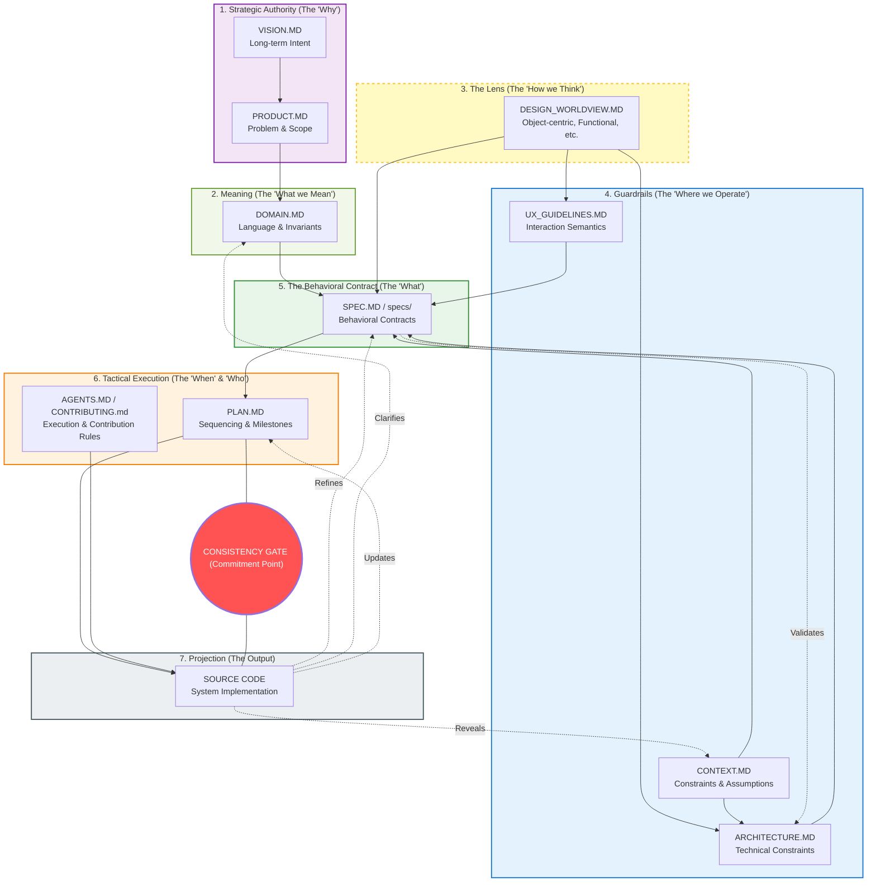

# Context-Driven Engineering (CDE)

This document elaborates on the mental model behind Context-Driven Engineering. Read **[CDE.md](../CDE.md)** first for the concise definition.

## Why Context-Driven Engineering Exists

Most software engineering problems are not caused by bad code.

They are caused by:

* Unclear intent
* Implicit assumptions
* Contradictory decisions made at different times
* Knowledge that lives in people’s heads instead of shared artifacts

Context-Driven Engineering (CDE) starts from a simple observation:

> Software systems fail when the *context* in which decisions are made is fragmented, implicit, or inconsistent.

CDE treats context not as supporting information, but as the **primary engineering medium** from which code is derived.

---

## What “Context” Means in CDE

In CDE, *context* is the collection of authoritative artifacts that explain:

* **Why** the system exists (intent, goals, non-goals)
* **What** the system must do (behavioral contracts)
* **How** the system is constrained (architecture, UX semantics)
* **When and in what order** work should happen (planning)
* **How decisions should be interpreted** (design worldview)

Context is explicit, versioned, and shared.
It is treated as a first-class design concern, not as background knowledge or tribal understanding.

In practice, these aspects are often externalized into distinct documents
(such as VISION.md, PRODUCT.md, DOMAIN.md, CONTEXT.md, ARCHITECTURE.md, and SPEC.md).
CDE treats these documents as concrete expressions of underlying conceptual responsibilities,
rather than as a prescribed checklist of artifacts.

Anything that materially influences design decisions but is not written down
cannot be inspected, challenged, or evolved, and therefore represents a design risk.

---

## The CDE System at a Glance

The diagram below shows Context-Driven Engineering as a *system of relationships*, not as a step-by-step process.

It exists to make explicit what is often implicit in software projects:
- where authority originates
- which artifacts constrain others
- how learning from reality feeds back into design decisions

The diagram combines two essential ideas:
- **Authority flow** (solid arrows), moving downward from intent to implementation
- **Feedback flow** (dotted arrows), moving upward from reality back into context

A **Consistency Gate** highlights moments of commitment, where context and code must be brought back into alignment.

Not every project will exercise every relationship equally; the diagram shows the complete model, not a mandatory checklist.

The sections below walk through these relationships in more detail.

---

## Authority Flow and Feedback Loops

CDE models software development as a system with two complementary flows.

### Authority Flow (Top-Down)

Authority flows from *intent* to *implementation*:

* **Vision and Product** define the problem space
* **Design Worldview** defines the lens through which decisions are interpreted
* **Architecture and UX Guidelines** define hard constraints
* **Specifications** define behavioral contracts
* **Plans and Agent Rules** govern execution
* **Code** is the observable outcome

In CDE, downstream artifacts are not treated as overriding upstream authority without explicit revision of the context.

Authority in this sense is conceptual, not hierarchical. It defines which decisions constrain others, not who is allowed to make them.

---

### Feedback Flow (Bottom-Up)

Reality pushes back.

As code is written and systems are exercised:

* Hidden constraints are discovered
* Assumptions are invalidated
* Edge cases emerge

This learning flows *upward*:

* Code refines specifications and clarifies domain meaning and contextual assumptions
* Specifications validate or challenge architecture
* Plans are updated based on actual progress

CDE does not deny exploration. It structures how learning is captured.

---

## Code as Downstream Projection

In CDE, code is not the primary source of truth.

It is a **projection** of the current context.

This does not diminish the importance of code. It clarifies responsibility:

* If code behaves incorrectly, the first question is not “who wrote this?”
* The first question is “where was the context unclear, contradictory, or incomplete?”

This shift moves teams away from blame and toward systemic improvement.

---

## Commitment Points and the Consistency Gate

CDE distinguishes between ongoing exploration and **commitment points**.

Commitment points include:

* Preparing a release
* Reaching a milestone
* Handing work to another developer or team
* Asking an AI agent to extend existing behavior

At these points, a **Consistency Gate** applies:

* Specifications align with architecture
* Terminology matches domain meaning and is consistent
* Declared design worldview is not violated

If inconsistencies are found, work pauses until the context is reconciled.

This gate is a safety valve, not a bureaucracy.

---

## The Role of the Design Worldview

CDE is intentionally worldview-agnostic.

However, when a **DESIGN_WORLDVIEW.md** is present, it becomes a **normative lens** for interpretation.

The worldview:

* Defines how concepts such as “state”, “behavior”, and “collaboration” should be understood
* Prevents mixing incompatible paradigms unintentionally
* Applies equally to humans and AI agents

Violations of the declared worldview trigger a stop condition.

---

## Humans and AI Agents as Symmetric Actors

CDE assumes that:

* Humans and AI agents work from the same context
* Both are constrained by the same rules
* Neither is trusted to “fill in the gaps” silently

AI agents are treated as junior contributors:

* Fast
* Tireless
* Literal
* Dangerous when underspecified

This symmetry forces precision and reduces hidden assumptions.

---

## What CDE Is Not

CDE is not:

* Prompt engineering
* A replacement for judgment or experience
* A guarantee of perfect software
* A mass-adoption methodology

It is a discipline for teams and individuals who are willing to trade improvisation for clarity when the cost of misalignment is high.

---

## When CDE Works Best

CDE shines when:

* Systems are long-lived
* Multiple people or agents collaborate
* Architectural integrity matters
* Knowledge transfer is expected

It is intentionally overkill for throwaway prototypes.

---

## In Summary

Context-Driven Engineering treats context as the primary engineering artifact.

Authority flows downward.

Learning flows upward.

Code is the result, not the starting point.

When context is coherent, software becomes easier to reason about, extend, and trust.
